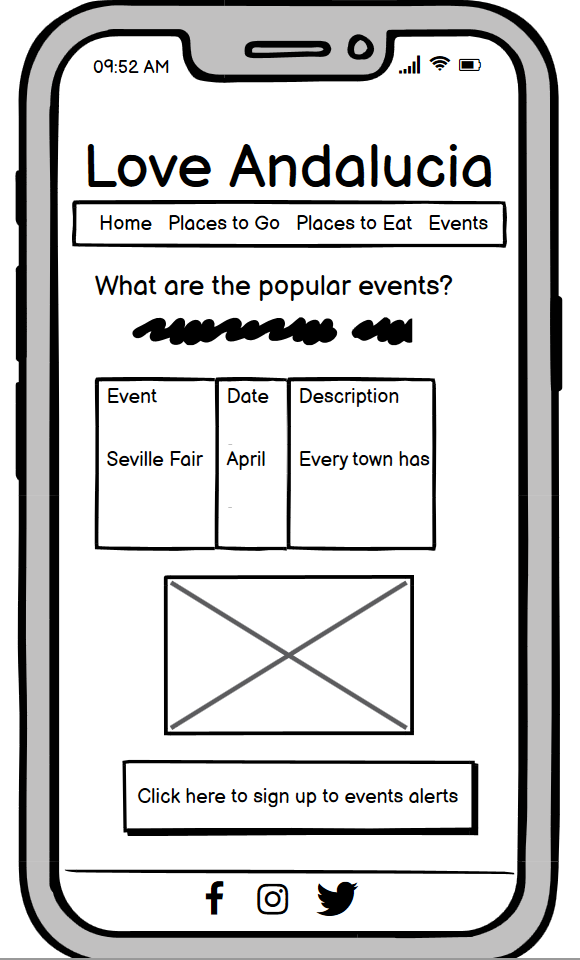

# **_Love Andalucia_**

Love Andalucia is a travel website targeted at travelling enthusiasts who want to learn more about the Spanish region of Andalucía before planning a trip.  This website aims to inform the reader about interesting places to visit, a variety of cuisines typical of the region and seasonal events that they may be interested in seeing during their trip. 
I hope to give the reader a wide variety of ideas of things to do across a range of coastal and inland, city, and countryside locations.  I also encourage the reader to sign up to the events newsletter so they may coincide their trip with an exciting cultural event. 

Welcome to <a href="https://quiltingcode.github.io/loveandalucia/" target="_blank" rel="noopener">Love Andalucia</a>

# Contents

* [**User Experience UX**](<#user-experience-ux>)
    * [Wireframes](<#wireframes>)
    * [Site Structure](<#site-structure>)
    * [Design Choices](<#design-choices>)
    *  [Typography](<#typography>)
    *  [Colour Scheme](<#colour-scheme>)
* [**Current Features**](<#currentfeatures>)
    * [**Home**](<#navigation-menu>)
         * [Navigation menu](<#navigation-menu>)
         * [Welcome Section](<#welcome-section>)
         * [Map](<#map>)
         * [Footer](<#footer>)
    * [**Places**](<#places>)
    * [**Food**](<#food>)
    * [**Events**](<#events>)
    * [**Sign-up Page**](<#sign-up>)
* [**Future Features**](<#future-features>)
* [**Technologies Used**](<#technologies-used>)
* [**Testing**](<#testing>)
* [**Deployment**](<#deployment>)
* [**Credits**](<#credits>)
    * [**Content**](<#content>)
    * [**Media**](<#media>)
*  [**Acknowledgements**](<#acknowledgements>)

# User Experience (UX)

## Wireframes

The wireframes for the Love Andalucia project were produced in Balsamiq.  There are frames for a desktop device and for a mobile device.  

## Desktop Device Wireframes 

## Mobile Device Wireframes

 
 
 
 
 

I initially only designed the site on desktop size wireframes, and the intention was to put the events and signup information all together in one page. For this reason, there are only 4 desktop size wireframes. However, once I started to build the site, it made more sense to focus the page solely with events information in a table and then put a link to a separate sign-up page with a form. 
Later during the build, I created the wireframes for the mobile device. Here you can see the events page and form signup page separately. 
In the second and third pages for desktop, I wanted to include a photo with each of the three categories and therefore I changed the layout in the end to show each category under each other with a photo next to it. 

[Back to top](<#contents>)

## Site Structure

Love Andalucia has five pages.  The home page is the default loading page, and then there is a navigation bar to access the places, food, and events pages. From the events page, you can click the sign-up button to access the form page. From any of the pages you can also click on the Love Andalucia header to return the home page. 

[Back to top](<#contents>)

## Design Choices

 * ### Typography

The fonts I chose were ‘Nothing you could do’ for the h1 and h2 headings and ‘Itim’ for the body.  If these fonts are not available, they revert to cursive and sans-serif.  I chose the ‘Nothing you could do’ header primarily as I envisaged an Italic style calligraphy font, but then I wanted something more legible for the main text, so I found ‘Itim’ gave a nice contrast whilst maintaining something easier on the eye for larger areas of text. 

 * ### Colour Scheme

The colour scheme I chose was initially based on the idea of a Mediterranean blue colour, similar to the blue roofs painted in traditional old-style Greek and Spanish towns. From there, I used the sessions.edu colour combination website to find a set of complimentary tones to give the whole website a bright, fresh, Mediterranean look and feel. 

[Back to top](<#contents>)

# Current Features

  
## Navigation Menu

At the top of the website, on all pages, is the main title of the website and the navigation bar underneath. This makes it easy to navigate back to the homepage or to the three other pages of the website easily from any page. The nav bar introduces the colour palette to the user and indicates which page you are currently browsing, by underlining the current page.
The title header can also be clicked on as a navigation tool back to the home page.

[Back to top](<#contents>)

## welcome Section

On the home page, I have written a brief introduction to the Andalucia region and included an inviting photo to encourage the user to read on. 
Then the user is posed the question; Why come to Andalucia? This gives the user the option to focus their search into one of three categories. These three buttons use all three tones from web design colour palette. 
1.	Places – which takes them to the same place as the ‘Places to Go’ navigation bar option. This page describes places in Andalucia in more detail.
2.	Food – which takes them to the same place as the ‘Places to Eat’ navigation bar option. This page describes the Andalucian cuisine in more detail. 
3.	Events – which takes them to the same place as the ‘Events’ navigation bar option, and displays a list of the most famous Andalucian events. 
 

[Back to top](<#contents>)

## Map

Finally, the user is shown a map of the Andalucia region and where it is in relation to Spain, and the world if you wish to use the zoom feature. I inserted this google map link using https://google-map-generator.com/ . I have also given some information regarding the best way to travel to Andalucia and then the best ways to get around once you arrive. 

[Back to top](<#contents>)

## Footer
    
The footer contains two elements. 
1.	Telephone and Email details to get in touch if the user wants further information. I used Font Awesome icons for the telephone and email icon here.
2.	Social Media links to Facebook, Instagram, and Twitter. I have also used the Font Awesome icons here instead of just writing the names. Each social media icon links out into a new page and takes the user to the log-in page of the desired social media site. If this was a real site and I had real social media accounts setup, I would direct the users into my own Love Andalucia account. 
The footer is designed using the same colour palette as the navigation bar to give the page symmetry and balance between the top and the bottom features. 

    

[Back to top](<#contents>)

## Places

If the user selects the ‘Places to go’ option from the navigation bar, or the ‘Places’ option in the Welcome section they are taken to the Places page. 
The user is asked a further question to focus their search criteria once again. “What type of holiday are you looking for?” Three options are again presented in the same style as the home page categories, and the same button format with alternating colours is given to maintain continuity between the pages. The user is now familiar with this system of drilling down through the search options. If no option is selected, the user can simply scroll down at will through the three categories one by one in the same order shown from left to right across the buttons. 

Scrolling down the page, or selecting a holiday category of City, Coastal or Country, the user is then given a list of the top 5 holiday destinations in the given category and an image relating to given category as well. 

When viewing this page with a mobile device, the images are shown under each list of best holiday destinations. However, when viewing this page in tablet form or bigger, I have used responsive design to float the images to the right of each list, making better use of the wider space available and improving the user experience.

[Back to top](<#contents>)

## Food

This page is set out in a very similar way to the Places page to give continuity to the website as a whole and maintain a positive user experience whereby they can learn the navigation as they go through.
If the user selects the ‘Places to Eat’ option from the navigation bar, or the ‘Food’ option in the Welcome section they are taken to the Food page. 
The page starts in the same way as the Places page, with a question to the user. “What type of food do you want to eat?” Once again, the user is presented with three familiar options; Michelin Starred food, Traditional food, or Beach food. They can select an option and travel down the page directly to that section or scroll through each in turn.

Scrolling down the page or selecting a food category, the user is given some information about each category specifically relating to the Andalucia region and an example of each category is given in the form of an image.

[Back to top](<#contents>)

## Events

If the user selects the ‘Events’ option from the navigation bar or the ‘Events’ button in the Welcome section, they are taken to the Events page. 
In line with the page format of Places and Food, the Events page poses the question “What are the most popular events in Andalucia?”
There is an introductory text about festivals in the Andalucia region and then there is a table with information regarding the most popular annual events. I used the https://www.andalucia.com/festival/home.htm website to source information for this page. I have also included a link to this page on the website for users to click through and find further details as they wish. 

Underneath the table is a button, which gives the user the option to sign up to a quarterly newsletter whereby they would receive regular information regarding events in the Andalucia region. If they click on the link it takes them to the Sign-Up page. 

[Back to top](<#contents>)

## Sign up Page

This is the final stage on the user journey through the website. If they click on the sign-up link on the Events page, they are taken to the sign up page and invited to fill in their details in a form and submit. 
They are prompted to fill in their first name, last name and email address and also choose whether they prefer summer events, winter events, or both by way of radio button options. All three data fields are required to be filled in along with at least one radio button.

If the user fills in all the details correctly and clicks the submit button, they will be taken to a confirmation page, with a short message thanking them for signing up and giving them a link to go back to the home page and start their journey again. 
For the purposes of this project, when you click the submit form button, the form is only validated, but not sent anywhere. 
The html code for this page is based on the form page used in the Code Institute Love Running project. I then changed the code to fir my own page requirements and styled it in line with the Love Andalucia Mediterranean colour palette. 

[Back to top](<#contents>)

## Future Features 

In the future, I would like to add more pages to the Love Andalucia website. These could include information pertaining to:

* Dancing in Andalucia and the famous cultural style of Flamenco
* Gallery
* Agriculture

If the Love Andalucia website is successful, I would like to use the ‘Love’ theme to branch out and create pages for all the 17 autonomous communities in Spain. For example, Love Valencia, Love La Rioja, Love Cantabria and so on. 
I would also need to keep the events page up to date and add new popular events when necessary. 

[Back to top](<#contents>)

# Technologies Used

I used the following technologies to create this website:

* HTML5 – content and structure
* CSS - styling
* Balsamiq – wireframe designs
* Gitpod – website deployment
* Github – website hosting

[Back to top](<#contents>)

# Testing

Please click [**_here_**](TESTING.md) to read more information about testing Love Andalucia

[Back to top](<#contents>)

# Deployment

### **To deploy the project**
The site was deployed to GitHub pages. The steps to deploy a site are as follows:
  1. In the GitHub repository, navigate to the **Settings** tab.
  2. Once in Settings, navigate to the **Pages** tab down the side menu.
  3. Under **Source**, select the branch to **master**, then click **save**.
  4. Once the master branch has been selected, the page will be automatically refreshed with a detailed ribbon display to indicate a successful deployment.

  The live link to the Github repository can be found here - https://quiltingcode.github.io/loveandalucia/

[Back to top](<#contents>)

# Credits
### Content

* The introduction text for the Home page was researched from the following websites:
    * https;//www.andalucia.com
    * https;//www.airport-malaga.com
    * https;//en.m.wikipedia.org/wiki/Andalusia
    *  https;//www.visit-andalucia.com
•	Instructions on how to create responsive break points using the mobile first approach were taken from https://kinsta.com/blog/responsive-web-design/#set-your-media-query-ranges-responsive-breakpoints
•	Information used to write the top 5 coastal retreats was taken from: https://www.ruralidays.co.uk/travel/beaches/best-beaches-in-andalucia-spain/
•	Information for the top 5 beaches was taken from https://www.andalucia.com/top10s/beaches.htm 
•	Information for the events was taken from https://www.andalucia.com/festival/home.htm
•	Instructions on how to implement form validation was taken from the Code Institute CSS module videos.
•	The icons in the footer were taken from Font Awesome
•	The fonts were taken from Google Fonts
•	The map code was generated from https://google-map-generator.com/
•	The colour palette was created with the help of https://sessions.edu 
•	The inspiration for the three category boxes came from the Love Running Walk Through Project Meetup Times boxes.
•	Instructions on how to create responsive break points using the mobile first approach were taken from https://kinsta.com/blog/responsive-web-design/#set-your-media-query-ranges-responsive-breakpoints
•	Information used to write the top 5 coastal retreats was taken from: https://www.ruralidays.co.uk/travel/beaches/best-beaches-in-andalucia-spain/
•	Information for the top 5 beaches was taken from https://www.andalucia.com/top10s/beaches.htm 
•	Information for the events was taken from https://www.andalucia.com/festival/home.htm
•	Instructions on how to implement form validation was taken from the Code Institute CSS module videos.
•	The icons in the footer were taken from Font Awesome
•	The fonts were taken from Google Fonts
•	The map code was generated from https://google-map-generator.com/
•	The colour palette was created with the help of https://sessions.edu 
•	The inspiration for the three category boxes came from the Love Running Walk Through Project Meetup Times boxes.
•	Instructions on how to create responsive break points using the mobile first approach were taken from https://kinsta.com/blog/responsive-web-design/#set-your-media-query-ranges-responsive-breakpoints
•	Information used to write the top 5 coastal retreats was taken from: https://www.ruralidays.co.uk/travel/beaches/best-beaches-in-andalucia-spain/
•	Information for the top 5 beaches was taken from https://www.andalucia.com/top10s/beaches.htm 
•	Information for the events was taken from https://www.andalucia.com/festival/home.htm
•	Instructions on how to implement form validation was taken from the Code Institute CSS module videos.
•	The icons in the footer were taken from Font Awesome
•	The fonts were taken from Google Fonts
•	The map code was generated from https://google-map-generator.com/
•	The colour palette was created with the help of https://sessions.edu 
•	The inspiration for the three category boxes came from the Love Running Walk Through Project Meetup Times boxes.
* Instructions on how to create responsive break points using the mobile first approach were taken from https://kinsta.com/blog/responsive-web-design/#set-your-media-query-ranges-responsive-breakpoints
* Information used to write the top 5 coastal retreats was taken from: https://www.ruralidays.co.uk/travel/beaches/best-beaches-in-andalucia-spain/
* Information for the top 5 beaches was taken from https://www.andalucia.com/top10s/beaches.htm 
* Information for the events was taken from https://www.andalucia.com/festival/home.htm
* [Balsamiq](https://balsamiq.com/wireframes/) was used to create the wireframes.
* Instructions on how to implement form validation was taken from the Code Institute CSS module videos.
* The icons in the footer were taken from Font Awesome
* The fonts were taken from Google Fonts
* The map code was generated from https://google-map-generator.com/
* The colour palette was created with the help of https://sessions.edu 
* The inspiration for the three category boxes came from the Love Running Walk Through Project Meetup Times boxes.

### Media
* The images used in this website are sourced from https://unsplash.com and https://pixabay.com
* Some photos were compressed using https://tinypng.com/ 

[Back to top](<#contents>)

# Acknowledgements
The site was completed as a Portfolio 1 Project piece for the Full Stack Software Developer (e-Commerce) Diploma at the [Code Institute](https://codeinstitute.net/). As such I would like to thank my mentor [Precious Ijege](https://www.linkedin.com/in/precious-ijege-908a00168/), the Slack community, and all at the Code Institute for their help and support. Love Andalucia is a fictional website but based on an area that is very close to my heart. It would make me so happy if this was a real website that encouraged more people to fall in love with Andalucia as I have.

Kelly Hutchison 2022.

[Back to top](<#contents>)s